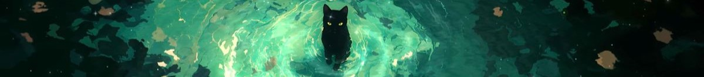

  <h1> Olá, eu sou a Ana </h1>

  <h2 style='fontcolor=#2E8B57'>✨Um pouco sobre mim </h2> 
  

      
🎓 Sou formada em Técnico em Administração de Empresas.

      
💻 Atualmente graduanda de Engenharia de Software.

      
🚀 Iniciante no mundo de desenvolvimento de programas e apaixonada pelo back-end, criação de jogos, ciência dos dados e automação.

      
🐍 Estudei um básico da linguagem Java e estou focando em Python no momento.

      
Para mim, teoria e prática caminham juntas, mas é no código que o aprendizado se solidifica de verdade, cada linha representa uma pequena conquista no meu caminho como desenvolvedora! 🚀

      
Vamos nos conectar? Me envie um e-mail, me siga no LinkedIn ou confira meu conteúdo no Instagram! 💌✨ 

 
  
  
   
  

 
   

<picture>
  <source media="(prefers-color-scheme: dark)" srcset="https://raw.githubusercontent.com/Ana-Vianx/Ana-Vianx/output/pacman-contribution-graph-dark.svg">
  <source media="(prefers-color-scheme: light)" srcset="https://raw.githubusercontent.com/Ana-Vianx/Ana-Vianx/output/pacman-contribution-graph.svg">
  
</picture>

## 💻 Tecnologias e linguagens de desenvolvimento

  

